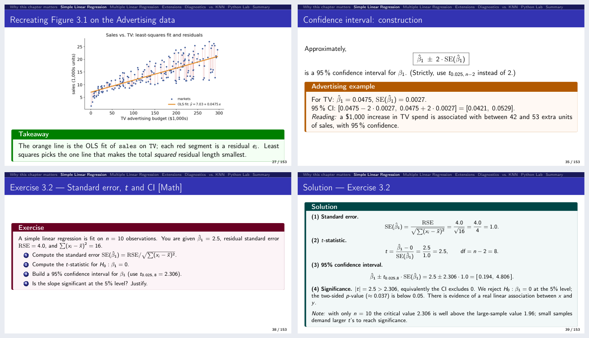

<h1 align="center">Quantitative Research Methods</h1>

<p align="center">
  A complete, ready-to-teach university course in statistical learning —<br>
  twelve slide decks, fifteen Jupyter labs, three mock exams, and the course datasets.
</p>

<p align="center">
  
  
  
  
  <a href="#-lab-notebooks"></a>
  <a href="https://chrisw09.github.io/Quantitative-Research-Methods/"></a>
</p>

<p align="center">
  <b>1029 core slides</b> (+111 in optional appendices) ·
  <b>127 exercises</b> with worked solutions ·
  <b>15 labs</b> that run locally &amp; on Colab ·
  <b>3 mock exams</b> · <b>22 datasets</b>
</p>

<p align="center">
  <b>📖 Read it online: <a href="https://chrisw09.github.io/Quantitative-Research-Methods/">chrisw09.github.io/Quantitative-Research-Methods</a></b>
</p>

> **These materials are based on the textbook** *An Introduction to Statistical
> Learning, with Applications in Python* (James, Witten, Hastie, Tibshirani &
> Taylor, Springer 2023 — "ISLP"). The course structure, topics, notation and
> labs follow the book; please cite it if you reuse these materials
> (see [Citation & licence](#-citation--licence)).

Prepared by **Prof. Dr. Christoph Weisser** (HSBI — Bielefeld University of
Applied Sciences and Arts), Summer Semester 2026.

---

## Start here

| | Where to go | What you get |
|:--:|---|---|
| 🎓 | **Learning it** — [read a deck](#-lecture-slides), then [run its lab](#-lab-notebooks) | The compiled PDFs need no toolchain; every notebook opens in Colab with one click and resolves its own data. |
| 👩‍🏫 | **Teaching it** — [the teaching guide](#-teaching-it) | A twelve-week plan, per-session runsheets with timings and cut lists, a generated slide index, and one `make` command that keeps them in sync with the decks. |
| 🛠️ | **Adapting it** — [repository layout](#-repository-layout) | LaTeX sources for every deck and exam, figures regenerated from the datasets by script, and a pinned Python environment. |

### What's inside

| Material | Count | Notes |
|---|---|---|
| [Lecture decks](#-lecture-slides) | 12 | Ten ISLP chapters + a two-part optional precourse · 1029 slides, plus 111 in per-deck appendices |
| Exercises | 86 short + 41 extended | Each with a full worked solution, tagged [Concept] / [Math] / [Python] / [Integrative] |
| [Lab notebooks](#-lab-notebooks) | 15 | Twelve lecture chapters + three self-study chapters (SVM, survival, unsupervised) |
| [Mock exams](#-mock-exams) | 3 | Each as questions, worked solutions and an in-class review deck — kept out of git |
| [Datasets](#-python-environment--datasets) | 22 CSVs | From [statlearning.com](https://www.statlearning.com), resolved automatically via `ISLP` |
| [Teaching guide](#-teaching-it) | 1 kit | Semester plan, runsheets, slide index, before-class checklist, printable handouts |

---

## 🚀 Quick start

You don't need to install anything to *read* the slides — the compiled PDFs live
right in the repo. To *run* a lab you have two options.

**▶︎ Google Colab — zero setup (recommended).** Open any notebook from the
[lab table](#-lab-notebooks) in your browser; nothing to install. The first cell
detects Colab, installs the few missing packages (`ISLP`, plus
`pygam`/`xgboost`/`lifelines` where a chapter needs them; `torch` is
preinstalled), and resolves the data automatically. A Google account is enough —
no account on this repository is needed.

**⌥ Local Jupyter.**

```bash
python -m venv .venv
source .venv/bin/activate         # Windows: .venv\Scripts\activate
pip install -r requirements.txt
jupyter lab Lab_Notebooks/chapter_03_lab.ipynb
```

Tested with **Python 3.9+**. Data loads via the `ISLP` package when installed,
falling back to the bundled `ALL CSV FILES - 2nd Edition/` folder, so it also
works offline.

---

## 📚 The course at a glance

A 12-lecture semester (12 × 180 min):

| Lecture | Chapter | Topic |
|:--:|:--:|--|
| 0 *(optional)* | — | **Precourse (a)**: descriptive statistics, probability, distributions, inference, simple regression, Python — matrix algebra and calculus in the appendix |
| 0b *(optional)* | — | **Precourse (b)**: reading notation, logs & exponentials, odds & the logit, likelihood and MLE, counting & cost, the Python patterns of the labs |
| 1 | 1 + 2 (part 1) | Introduction; what is statistical learning; prediction vs. inference |
| 2 | 2 (part 2) | Model accuracy; bias–variance trade-off; Bayes classifier; KNN |
| 3–4 | 3 | Linear regression: estimation, inference, dummies, interactions, diagnostics |
| 5–6 | 4 | Classification: logistic regression, LDA/QDA, naive Bayes, ROC, Poisson |
| 7 | 5 | Resampling: validation set, k-fold CV, LOOCV, bootstrap |
| 8 | 6 | Model selection & regularization: subset selection, ridge, lasso, PCR/PLS |
| 9 | 7 | Beyond linearity: polynomials, splines, smoothing splines, GAMs |
| 10 | 8 | Tree-based methods: trees, bagging, random forests, boosting |
| 11 | 10 | Deep learning: MLPs, CNNs, training, regularization (PyTorch) |
| 12 | 13 | Multiple testing: FWER, Bonferroni/Holm, FDR, Benjamini–Hochberg |

Chapters 2, 3 and 4 each span two lectures, breaking at a section boundary:
after KNN / bias–variance, after "Goodness of fit / the four questions", and
after multiple logistic regression.

> Chapters **9 (SVM), 11 (Survival) and 12 (Unsupervised)** aren't part of the
> 12-lecture plan but ship as **self-study lab notebooks** for completeness.

---

## 🎞️ Lecture slides

Twelve decks in `Lecture_Slides/chapter_NN/`, each folder self-contained
(`chapter_NN.tex`, its `images/`, and the compiled PDF). Slide counts are given
as **main flow (+ appendix)**: every deck ends with an appendix of optional,
advanced material that the main thread never depends on.

<p align="center">
  
  <br><sub>Chapter 3: a computed figure with its takeaway, a worked example, an in-deck exercise, and the solution that follows it.</sub>
</p>

| Ch. | Deck | What it covers | Exercises | Slides | PDF |
|:--:|---|---|:--:|:--:|:--:|
| 0 | Precourse (a) — Statistics refresher *(optional)* | Descriptive statistics, probability and Bayes, distributions, standard errors and CIs, testing and power, simple regression, the Python toolkit | 10 + 4 | 104 (+16) | [PDF](./Lecture_Slides/chapter_00/chapter_00.pdf) |
| 0b | Precourse (b) — Toolkit *(optional)* | Reading notation, logs and exponentials, odds and the logit, likelihood, computational cost, the Python patterns the labs use | 6 + 2 | 48 (+9) | [PDF](./Lecture_Slides/chapter_00b/chapter_00b.pdf) |
| 1 | Introduction | What statistical learning is, prediction vs. inference, the three motivating data sets, notation and the design matrix | 3 + 1 | 68 (+6) | [PDF](./Lecture_Slides/chapter_01/chapter_01.pdf) |
| 2 | Statistical Learning | Estimating *f*, parametric vs. nonparametric, the flexibility trade-off, training vs. test error, bias–variance, Bayes classifier and KNN | 8 + 4 | 105 (+8) | [PDF](./Lecture_Slides/chapter_02/chapter_02.pdf) |
| 3 | Linear Regression | Least squares, standard errors and *t*/*F* inference, confidence vs. prediction intervals, dummies and interactions, the four diagnostics | 12 + 6 | 142 (+11) | [PDF](./Lecture_Slides/chapter_03/chapter_03.pdf) |
| 4 | Classification | Logistic regression and the odds scale, confounding, LDA, QDA, naive Bayes, confusion matrices, ROC and AUC | 10 + 6 | 110 (+15) | [PDF](./Lecture_Slides/chapter_04/chapter_04.pdf) |
| 5 | Resampling Methods | The validation set and why it wobbles, LOOCV, *k*-fold CV and the trade-off inside the estimate, CV pitfalls, the bootstrap | 6 + 3 | 77 (+7) | [PDF](./Lecture_Slides/chapter_05/chapter_05.pdf) |
| 6 | Model Selection & Regularization | Best subset and stepwise selection, Cₚ/AIC/BIC/adjusted R², ridge, the lasso and its sparsity, PCR, the *p* > *n* regime | 7 + 3 | 79 (+11) | [PDF](./Lecture_Slides/chapter_06/chapter_06.pdf) |
| 7 | Moving Beyond Linearity | Polynomials and step functions, regression splines and knots, natural splines, smoothing splines, LOESS, GAMs | 6 + 3 | 83 (+7) | [PDF](./Lecture_Slides/chapter_07/chapter_07.pdf) |
| 8 | Tree-Based Methods | Recursive binary splitting, pruning, impurity measures, bagging and out-of-bag error, random forests, boosting | 7 + 3 | 81 (+7) | [PDF](./Lecture_Slides/chapter_08/chapter_08.pdf) |
| 10 | Deep Learning | Single-layer networks and activations, MLPs and parameter counts, convolutions and pooling, loss and SGD, regularisation | 6 + 3 | 71 (+8) | [PDF](./Lecture_Slides/chapter_10/chapter_10.pdf) |
| 13 | Multiple Testing | Why naive testing fails at scale, FWER, Bonferroni and Holm, the false discovery rate, Benjamini–Hochberg, *p*-hacking | 5 + 3 | 61 (+6) | [PDF](./Lecture_Slides/chapter_13/chapter_13.pdf) |
| **Total** | | | **86 + 41** | **1029 (+111)** | |

<details>
<summary><b>How a deck is built</b></summary>

1. **Front matter** — course-at-a-glance, chapter contents, and a "Notation in
   this chapter" symbol table.
2. **Teaching flow** — motivation → intuition → formal definition → worked
   example → interpretation, with colour-coded callout boxes: 🟩 takeaway,
   🟦 how-to-read-this, 🟧 worked example, 🟥 pitfall, 🟪 short exercise (🟩 teal
   solution), 🟣 extended exercise, 🩵 "switch to the notebook now".
3. **Exercises** — one short exercise every ~20 minutes and one extended
   exercise every ~45 minutes, each tagged **[Concept] / [Math] / [Python]**
   (short) or **[Math] / [Python] / [Integrative]** (extended). Every prompt is
   followed by its full solution; long ones run across a `(1/2)` / `(2/2)` pair.
4. **Closing summary** — chapter-in-one-slide, key formulas at a glance,
   vocabulary, decision rules and common pitfalls.
5. **Appendix** — the optional, advanced material, opened by a slide that says
   what is in it and why each item is optional.

Throughout: **~40 purpose-built visuals** (≈22 matplotlib plots computed from
the real course datasets + ≈18 native TikZ diagrams), commented Python on every
listing, and numeric answers reproduced against the real data.
</details>

<details>
<summary><b>What each appendix holds</b></summary>

The appendix sits outside the timed plan: the runsheets stop where it begins and
the slide index marks it *optional*. Every exercise there keeps its full
solution, so it works as homework.

| Ch. | In its appendix | Pages |
|:--:|---|:--:|
| 0 | χ²/*t*/*F* and LLN vs. CLT · the ANOVA decomposition · linear algebra (with Exercise 0.8) · calculus and gradient descent (with Extended Exercise 0.3) | 16 |
| 0b | least squares as maximum likelihood (with Extended Exercise 0b.1) · counting and the 2ᵖ cost (with Exercise 0b.5) | 9 |
| 1 | the design matrix entry by entry · the two dataset lookup tables | 6 |
| 2 | Extended Exercise 2.1 (bias–variance from first principles) · Extended Exercise 2.3 (the Bayes boundary for two Gaussians) | 8 |
| 3 | squared vs. absolute loss · Extended Exercise 3.L2 (deriving least squares) · the matrix form of multiple regression · Extended Exercise 3.L6 (linear vs. polynomial vs. KNN) | 11 |
| 4 | how logistic regression is actually fitted (deviance, IRLS) · the multinomial softmax · Extended Exercise 4.2 (LDA from Bayes' theorem) · Extended Exercise 4.3 (naive Bayes by hand) · GLMs and Poisson regression | 15 |
| 5 | Exercise 5.2 and Extended Exercise 5.1 — the LOOCV leverage-shortcut drills | 7 |
| 6 | the constraint geometry redrawn · Exercise 6.1 (counting models) · Extended Exercise 6.2 (orthonormal design, soft thresholding) · partial least squares with Exercise 6.6 | 11 |
| 7 | the truncated-power basis and the constraint count · Extended Exercise 7.1 (regression splines by hand) | 7 |
| 8 | the partition picture redrawn · Extended Exercise 8.2 (impurity measures and pruning) · BART | 7 |
| 10 | Extended Exercise 10.2 (CNN architecture arithmetic) · transformers · backpropagation · double descent | 8 |
| 13 | the four outcomes drawn · resampling-based inference · post-selection inference | 6 |
</details>

<details>
<summary><b>The two precourse decks</b></summary>

**Chapter 0 — the statistics refresher.** An optional session (104 slides plus a
16-slide appendix) revisiting what the course assumes: descriptive statistics,
probability and Bayes, the standard distributions, sampling and confidence
intervals, hypothesis testing, simple linear regression, and the
`numpy`/`pandas` toolkit; the matrix algebra and the calculus/gradient-descent
strands sit in its appendix. It opens with a twelve-question self-check so
students can decide whether they need it, and closes with a table mapping every
topic to the chapter that uses it. Eighteen figures — Anscombe's quartet,
Simpson's paradox, the CLT, CI coverage, power, gradient descent — are computed
from the course data by
[`make_figures.py`](./Lecture_Slides/chapter_00/make_figures.py); the companion
notebook is [`chapter_00_lab.ipynb`](./Lab_Notebooks/chapter_00_lab.ipynb).

**Chapter 0b — the toolkit.** A second optional session covering what the later
chapters use but never explain, chosen by counting actual usage across the ten
lecture decks: reading notation (Σ, Π, arg max, indicators, sets — 180 uses),
logs and exponentials (176), odds and the logit (108), likelihood and maximum
likelihood (37), counting and the 2ᵖ cost (13), and the Python patterns every
lab relies on (functions, loops, seeds, `fit`/`predict`, train/test discipline).
Companion notebook:
[`chapter_00b_lab.ipynb`](./Lab_Notebooks/chapter_00b_lab.ipynb).
</details>

<details>
<summary><b>Rebuilding a deck</b></summary>

Requires a TeX Live distribution (with `beamer`, `tcolorbox`, `tikz`,
`listings`, `booktabs`):

```bash
cd Lecture_Slides/chapter_NN
pdflatex chapter_NN.tex
pdflatex chapter_NN.tex   # second pass for the navigation bar
```

Or run `make` from the repository root: it rebuilds only what changed and
refreshes the slide index.
</details>

---

## 📓 Lab notebooks

Fifteen notebooks (`Lab_Notebooks/chapter_NN_lab.ipynb`) mirror each chapter's
Python lab, including both precourse sessions and the three self-study chapters.
Each runs **locally or on Google Colab**; data loads via the `ISLP` package with
an automatic fallback to the bundled CSVs, so nothing needs downloading by hand.

| Ch. | Lab | Open in Colab |
|:--:|--|:--:|
| 0 · Precourse (a) — Statistics | `chapter_00_lab.ipynb` | [](https://colab.research.google.com/github/ChrisW09/Quantitative-Research-Methods/blob/main/Lab_Notebooks/chapter_00_lab.ipynb) |
| 0b · Precourse (b) — Toolkit | `chapter_00b_lab.ipynb` | [](https://colab.research.google.com/github/ChrisW09/Quantitative-Research-Methods/blob/main/Lab_Notebooks/chapter_00b_lab.ipynb) |
| 1 · Introduction | `chapter_01_lab.ipynb` | [](https://colab.research.google.com/github/ChrisW09/Quantitative-Research-Methods/blob/main/Lab_Notebooks/chapter_01_lab.ipynb) |
| 2 · Statistical Learning | `chapter_02_lab.ipynb` | [](https://colab.research.google.com/github/ChrisW09/Quantitative-Research-Methods/blob/main/Lab_Notebooks/chapter_02_lab.ipynb) |
| 3 · Linear Regression | `chapter_03_lab.ipynb` | [](https://colab.research.google.com/github/ChrisW09/Quantitative-Research-Methods/blob/main/Lab_Notebooks/chapter_03_lab.ipynb) |
| 4 · Classification | `chapter_04_lab.ipynb` | [](https://colab.research.google.com/github/ChrisW09/Quantitative-Research-Methods/blob/main/Lab_Notebooks/chapter_04_lab.ipynb) |
| 5 · Resampling Methods | `chapter_05_lab.ipynb` | [](https://colab.research.google.com/github/ChrisW09/Quantitative-Research-Methods/blob/main/Lab_Notebooks/chapter_05_lab.ipynb) |
| 6 · Model Selection & Regularization | `chapter_06_lab.ipynb` | [](https://colab.research.google.com/github/ChrisW09/Quantitative-Research-Methods/blob/main/Lab_Notebooks/chapter_06_lab.ipynb) |
| 7 · Moving Beyond Linearity | `chapter_07_lab.ipynb` | [](https://colab.research.google.com/github/ChrisW09/Quantitative-Research-Methods/blob/main/Lab_Notebooks/chapter_07_lab.ipynb) |
| 8 · Tree-Based Methods | `chapter_08_lab.ipynb` | [](https://colab.research.google.com/github/ChrisW09/Quantitative-Research-Methods/blob/main/Lab_Notebooks/chapter_08_lab.ipynb) |
| 10 · Deep Learning | `chapter_10_lab.ipynb` | [](https://colab.research.google.com/github/ChrisW09/Quantitative-Research-Methods/blob/main/Lab_Notebooks/chapter_10_lab.ipynb) |
| 13 · Multiple Testing | `chapter_13_lab.ipynb` | [](https://colab.research.google.com/github/ChrisW09/Quantitative-Research-Methods/blob/main/Lab_Notebooks/chapter_13_lab.ipynb) |
| 9 · Support Vector Machines *(self-study)* | `chapter_09_lab.ipynb` | [](https://colab.research.google.com/github/ChrisW09/Quantitative-Research-Methods/blob/main/Lab_Notebooks/chapter_09_lab.ipynb) |
| 11 · Survival Analysis *(self-study)* | `chapter_11_lab.ipynb` | [](https://colab.research.google.com/github/ChrisW09/Quantitative-Research-Methods/blob/main/Lab_Notebooks/chapter_11_lab.ipynb) |
| 12 · Unsupervised Learning *(self-study)* | `chapter_12_lab.ipynb` | [](https://colab.research.google.com/github/ChrisW09/Quantitative-Research-Methods/blob/main/Lab_Notebooks/chapter_12_lab.ipynb) |

Every notebook is also
[rendered in full](https://chrisw09.github.io/Quantitative-Research-Methods/labs.html)
on the documentation site, stored outputs included.

---

## 👩‍🏫 Teaching it

[`Teaching_Guide/`](./Teaching_Guide/) holds what you need to walk into a room:

| File | What it is |
|---|---|
| [`semester_plan.md`](./Teaching_Guide/semester_plan.md) | The twelve weeks on one page, the three split points, and what to sacrifice when you fall behind |
| [`slide_index.md`](./Teaching_Guide/slide_index.md) | Generated from the PDFs: every section with its page range and time budget, every exercise and solution with its page |
| [`before_class.md`](./Teaching_Guide/before_class.md) | The ten-minute checklist for the evening before and the morning of |
| `runsheets/` | One page per session — timings, what to run live, what to cut, what students get wrong. Git-ignored: they map exercises onto exam problems |
| `handouts/` | Printable two-up PDFs of every deck (`make handouts`) |

Runsheet timings cover the **main flow** of a deck; appendix pages are material
to assign, not to teach.

```bash
make            # figures, any deck whose source changed, and the slide index
make check      # page counts, and any slide that overruns its frame
make handouts   # printable 2-up PDFs of every deck
make help       # the rest
```

---

## 📝 Mock exams

Three practice exams matched to the course rhythm, each built from a single
LaTeX source so the paper and its solutions can never diverge. All numeric
answers were verified programmatically. Each ships in three formats:
**questions**, **worked solutions**, and a **Beamer deck** for reviewing the
exam in class.

| Exam | After | Covers | Format |
|--|:--:|--|:--:|
| Mock Exam 1 | Lecture 4 | Ch 1–3 | 90 min · 90 pts |
| Mock Exam 2 | Lecture 8 | Ch 4–6 (+ light cumulative) | 90 min · 90 pts |
| Final Mock Exam | Lecture 12 | All chapters (weighted to Ch 7/8/10/13) | 120 min · 120 pts |

The final exam also exists in three parallel versions (A / B / C) — same
structure and difficulty, different numbers.

> 🔒 **Not distributed here.** The exams, their solutions and their LaTeX
> sources are assessment material and are deliberately kept out of this
> repository (see [`.gitignore`](./.gitignore)). Instructors can request them
> from the author.

---

## 🗂️ Repository layout

| Path | Contents |
|---|---|
| [`Lecture_Slides/`](./Lecture_Slides/) | Twelve Beamer decks (`chapter_NN/chapter_NN.tex` + `.pdf` + images) — the core deliverable. See its [deck guide](./Lecture_Slides/README.md). |
| [`Lab_Notebooks/`](./Lab_Notebooks/) | Fifteen Jupyter notebooks (`chapter_NN_lab.ipynb`), local- and Colab-ready |
| [`Teaching_Guide/`](./Teaching_Guide/) | Instructor material: semester plan, runsheets, slide index, before-class checklist, printable handouts |
| [`ALL CSV FILES - 2nd Edition/`](./ALL%20CSV%20FILES%20-%202nd%20Edition/) | Course datasets (from [statlearning.com](https://www.statlearning.com)) |
| [`Makefile`](./Makefile) | One-command rebuild of figures, decks, handouts and the index |
| [`docs/`](./docs/) | Sphinx documentation for the whole course — see [Documentation](#-documentation) |
| [`requirements.txt`](./requirements.txt) | Pinned Python environment for the notebooks |
| `Mock_Exams/` | Three exams (questions, solutions, review decks) — **excluded from git**: assessment material |
| `Source_Material/` | Copyrighted textbook PDF & figure banks — **excluded from git** (see [`.gitignore`](./.gitignore)) |

---

## 🐍 Python environment & datasets

[`requirements.txt`](./requirements.txt) pins the packages used by the notebooks
and the in-slide code examples:

| Purpose | Packages |
|---|---|
| Core scientific stack | `numpy` · `pandas` · `matplotlib` · `scipy` |
| Statistics & ML | `statsmodels` · `scikit-learn` |
| Book companion (datasets + helpers) | `ISLP` |
| Chapter-specific | `pygam` (Ch 7) · `xgboost` (Ch 8, optional) · `torch` (Ch 10) · `lifelines` (Ch 11) |
| Notebook environment | `jupyter` |

The datasets live in
[`ALL CSV FILES - 2nd Edition/`](./ALL%20CSV%20FILES%20-%202nd%20Edition/) and are
distributed by the textbook authors at
[statlearning.com](https://www.statlearning.com) for use with the book. In the
notebooks, **12 of the 13 datasets load straight from the `ISLP` package**; the
one that isn't in ISLP (`Advertising`) streams from the book's official site, and
the bundled CSVs act as an offline fallback. The decks attribute every book
figure to its source.

---

## 📖 Documentation

**📖 <https://chrisw09.github.io/Quantitative-Research-Methods/>**

Everything above — the lecture plan, the decks, all fifteen labs rendered in
full, the teaching guide, the exams and the datasets — is published as a
browsable site, rebuilt automatically by
[GitHub Actions](./.github/workflows/docs.yml) on every push to `main` that
touches the materials.

To build it locally from [`docs/`](./docs/):

```bash
pip install -r docs/requirements.txt
sphinx-build -b html docs docs/_build/html
open docs/_build/html/index.html          # Linux: xdg-open
```

The build stages the notebooks and the deck PDFs into the site automatically, so
the generated `docs/_build/html/` folder is self-contained. Details, including
how the deployment works, are in
[`docs/building-docs.md`](./docs/building-docs.md).

---

## 👤 About

I am Christoph Weisser, Professor of Mathematics, specializing in Business Data
Science at Hochschule Bielefeld (HSBI), and former Technical Lead Analytics &
Artificial Intelligence at BASF. My work focuses on Artificial Intelligence,
Generative AI, Business Data Science, and agentic AI systems that bridge research
with real-world industrial applications.

Before joining academia, I led international AI initiatives at BASF from strategy
through production deployment. Today, I combine research, teaching, open-source
software development, and selected industry collaborations to advance the
practical application of AI.

I hold two master’s degrees from the University of Oxford and the University of
St Andrews and completed the PhD Program in Applied Statistics & Empirical
Methods (summa cum laude) at Georg-August-Universität Göttingen. I was awarded
scholarships by the Studienstiftung des deutschen Volkes, the
Konrad-Adenauer-Stiftung, and the Evangelisches Studienwerk Villigst. I
regularly publish research in leading journals and at international conferences
and contribute to open-source software.

---

## 📄 Citation & licence

The **Quantitative Research Methods** course materials are based on, and follow
the structure of, the textbook *An Introduction to Statistical Learning, with
Applications in Python*. If you reuse them, please cite the source textbook:

> James, G., Witten, D., Hastie, T., Tibshirani, R., & Taylor, J. (2023).
> *An Introduction to Statistical Learning, with Applications in Python.*
> Springer Texts in Statistics. Springer. <https://www.statlearning.com>

BibTeX:

```bibtex
@book{islp2023,
  title     = {An Introduction to Statistical Learning: with Applications in Python},
  author    = {James, Gareth and Witten, Daniela and Hastie, Trevor and Tibshirani, Robert and Taylor, Jonathan},
  year      = {2023},
  publisher = {Springer},
  series    = {Springer Texts in Statistics},
  isbn      = {978-3-031-38746-3},
  doi       = {10.1007/978-3-031-38747-0},
  url       = {https://www.statlearning.com}
}
```

**Attribution.** The slides, exercises, mock exams and notebooks in this
repository were prepared by Prof. Dr. Christoph Weisser (HSBI), Summer Semester
2026. The ISLP textbook, its text and its figures are © the authors / Springer;
the datasets are distributed by the authors at
[statlearning.com](https://www.statlearning.com) for use with the book. The
copyrighted textbook PDF and figure banks are **not** included in this
repository (see [`.gitignore`](./.gitignore)).

<p align="center"><sub>Happy teaching 🎓</sub></p>
