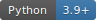
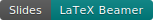

<h1 align="center">Quantitative Research Methods</h1>

<p align="center">
  A complete, ready-to-teach university course in statistical learning —<br>
  ten polished slide decks, thirteen Jupyter labs, three mock exams, and the course datasets.
</p>

<p align="center">
  
  
  
  
  <a href="#-open-any-notebook-in-colab"></a>
</p>

<p align="center">
  <b>10 Beamer decks · 13 Jupyter labs · 3 mock exams · ~105 exercises with worked solutions · runs locally &amp; on Colab</b>
</p>

<p align="center">
  <a href="#-why-these-materials">⚡ Why</a> &nbsp;·&nbsp;
  <a href="#-quick-start">🚀 Quick start</a> &nbsp;·&nbsp;
  <a href="#-the-course-at-a-glance">📚 Course</a> &nbsp;·&nbsp;
  <a href="#-lecture-slides">🎞️ Slides</a> &nbsp;·&nbsp;
  <a href="#-lab-notebooks">📓 Labs</a> &nbsp;·&nbsp;
  <a href="#-mock-exams">📝 Exams</a> &nbsp;·&nbsp;
  <a href="#-open-any-notebook-in-colab">▶️ Colab</a> &nbsp;·&nbsp;
  <a href="#-about">👤 About</a>
</p>

> **These materials are based on the textbook** *An Introduction to Statistical
> Learning, with Applications in Python* (James, Witten, Hastie, Tibshirani &
> Taylor, Springer 2023 — "ISLP"). The course structure, topics, notation and
> labs follow the book; please cite it if you reuse these materials
> (see [Citation & licence](#-citation--licence)).

Prepared by **Prof. Dr. Christoph Weisser** (HSBI — Bielefeld University of
Applied Sciences and Arts).

---

## Contents

- [Why these materials](#-why-these-materials)
- [Quick start](#-quick-start)
- [The course at a glance](#-the-course-at-a-glance)
- [Repository layout](#-repository-layout)
- [Lecture slides](#-lecture-slides)
- [Lab notebooks](#-lab-notebooks)
- [Mock exams](#-mock-exams)
- [Python environment](#-python-environment)
- [Datasets](#-datasets)
- [Open any notebook in Colab](#-open-any-notebook-in-colab)
- [About](#-about)
- [Citation & licence](#-citation--licence)

---

## ⚡ Why these materials

- **A whole course, not a pile of files.** Ten Beamer decks, thirteen labs and
  three mock exams that share one notation, one dataset set, and one 12-week
  rhythm — ready to teach as-is or adapt.
- **Slides built for the room.** Every deck moves motivation → intuition →
  formal definition → worked example, with colour-coded callout boxes and
  **~70 short + ~35 extended exercises**, each followed by a full solution.
- **Numbers you can trust.** ~40 purpose-built visuals are computed from the
  real course datasets (not sketched), and every mock-exam answer was verified
  programmatically.
- **Labs that run anywhere.** Thirteen Jupyter notebooks run locally *and* on
  Google Colab — data loads from the `ISLP` package with an automatic fallback
  to the bundled CSVs, so a fresh Colab runtime just works.
- **Exam-ready.** Three practice exams matched to the course calendar, each in
  three formats (questions, worked solutions, and an in-class review deck) built
  from a single LaTeX source so paper and solutions can never diverge.
- **Reproducible by design.** LaTeX sources for every deck and exam, a pinned
  Python environment, and datasets that resolve automatically.

---

## 🚀 Quick start

You don't need to install anything to read the slides or the mock exams — the
compiled PDFs live right in the repo. To *run* a lab you have two options:

### ▶︎ Google Colab — zero setup *(recommended)*

Open any notebook in your browser; nothing to install. Every notebook's first
cell detects Colab, quietly installs the few missing packages (`ISLP`, plus
`pygam`/`xgboost`/`lifelines` where a chapter needs them; `torch` is
preinstalled on Colab), and resolves the data automatically — **12 of the 13
datasets load straight from the `ISLP` package**, and the one that isn't in
ISLP (`Advertising`) streams from the book's official site.

Jump to [**Open any notebook in Colab**](#-open-any-notebook-in-colab) for a
one-click link to all thirteen labs.

> 🔒 **This repository is private.** The Colab links open once you're signed in
> to a Google account that has access to the repo (e.g. the owner). If you make
> the repo public, the links work for everyone.

### ⌥ Local Jupyter

```bash
python -m venv .venv
source .venv/bin/activate         # Windows: .venv\Scripts\activate
pip install -r requirements.txt
jupyter lab Lab_Notebooks/chapter_03_lab.ipynb
```

Tested with **Python 3.9+**. Data loads via the `ISLP` package when installed,
with an automatic fallback to the bundled `ALL CSV FILES - 2nd Edition/` folder.

---

## 📚 The course at a glance

A 12-lecture semester (12 × 180 min):

| Lecture | Chapter | Topic |
|:--:|:--:|--|
| 1 | 1 + 2 (part 1) | Introduction; what is statistical learning; prediction vs. inference |
| 2 | 2 (part 2) | Model accuracy; bias–variance trade-off; Bayes classifier; KNN |
| 3–4 | 3 | Linear regression: estimation, inference, dummies, interactions, diagnostics |
| 5–6 | 4 | Classification: logistic regression, LDA/QDA, naive Bayes, ROC, Poisson |
| 7 | 5 | Resampling: validation set, k-fold CV, LOOCV, bootstrap |
| 8 | 6 | Model selection & regularization: subset selection, ridge, lasso, PCR/PLS |
| 9 | 7 | Beyond linearity: polynomials, splines, smoothing splines, GAMs |
| 10 | 8 | Tree-based methods: trees, bagging, random forests, boosting |
| 11 | 10 | Deep learning: MLPs, CNNs, training, regularization (PyTorch) |
| 12 | 13 | Multiple testing: FWER, Bonferroni/Holm, FDR, Benjamini–Hochberg |

> Chapters **9 (SVM), 11 (Survival) and 12 (Unsupervised)** aren't part of the
> 12-lecture plan but ship as **self-study lab notebooks** for completeness.

---

## 🗂️ Repository layout

| Path | Contents |
|---|---|
| [`Lecture_Slides/`](./Lecture_Slides/) | Ten Beamer decks (`chapter_NN/chapter_NN.tex` + `.pdf` + images) — the core deliverable. See its [deck guide](./Lecture_Slides/README.md). |
| [`Lab_Notebooks/`](./Lab_Notebooks/) | Thirteen Jupyter notebooks (`chapter_NN_lab.ipynb`), local- and Colab-ready |
| [`Mock_Exams/`](./Mock_Exams/) | Three exams — each with a questions PDF, a solutions PDF, and a Beamer review deck |
| [`ALL CSV FILES - 2nd Edition/`](./ALL%20CSV%20FILES%20-%202nd%20Edition/) | Course datasets (from [statlearning.com](https://www.statlearning.com)) |
| [`requirements.txt`](./requirements.txt) | Pinned Python environment for the notebooks |
| `Source_Material/` | Copyrighted textbook PDF & figure banks — **excluded from git** (see [`.gitignore`](./.gitignore)) |

---

## 🎞️ Lecture slides

Ten decks (`Lecture_Slides/chapter_NN/`) share a consistent teaching design:

- **Front matter** — course-at-a-glance, chapter contents, and a "Notation in
  this chapter" symbol table.
- **Teaching flow** — motivation → intuition → formal definition → worked
  example, with colour-coded callout boxes (green takeaway, blue how-to-read,
  orange worked example, red pitfall).
- **~70 short exercises** (~5 min) in purple boxes, each with a full
  step-by-step solution (teal), plus **~35 extended, multi-part exercises**
  (~15 min) in violet boxes with detailed multi-slide solutions.
- **~40 purpose-built visuals** — ≈22 matplotlib plots computed from the real
  course datasets plus ≈18 native TikZ concept diagrams.
- **Commented Python** on every code listing, and a cyan "Companion notebook"
  box marking exactly when to switch to the Jupyter lab.
- **Closing summary** — chapter-in-one-slide, key formulas, vocabulary,
  decision rules, and common pitfalls.

| Ch. | Deck | Open |
|:--:|--|:--:|
| 1 | Introduction | [PDF](./Lecture_Slides/chapter_01/chapter_01.pdf) |
| 2 | Statistical Learning | [PDF](./Lecture_Slides/chapter_02/chapter_02.pdf) |
| 3 | Linear Regression | [PDF](./Lecture_Slides/chapter_03/chapter_03.pdf) |
| 4 | Classification | [PDF](./Lecture_Slides/chapter_04/chapter_04.pdf) |
| 5 | Resampling Methods | [PDF](./Lecture_Slides/chapter_05/chapter_05.pdf) |
| 6 | Linear Model Selection & Regularization | [PDF](./Lecture_Slides/chapter_06/chapter_06.pdf) |
| 7 | Moving Beyond Linearity | [PDF](./Lecture_Slides/chapter_07/chapter_07.pdf) |
| 8 | Tree-Based Methods | [PDF](./Lecture_Slides/chapter_08/chapter_08.pdf) |
| 10 | Deep Learning | [PDF](./Lecture_Slides/chapter_10/chapter_10.pdf) |
| 13 | Multiple Testing | [PDF](./Lecture_Slides/chapter_13/chapter_13.pdf) |

<details>
<summary><b>Rebuilding a deck</b></summary>

Requires a TeX Live distribution (with `beamer`, `tcolorbox`, `tikz`,
`listings`, `booktabs`):

```bash
cd Lecture_Slides/chapter_NN
pdflatex chapter_NN.tex
pdflatex chapter_NN.tex   # second pass for the navigation bar
```
</details>

---

## 📓 Lab notebooks

Thirteen notebooks (`Lab_Notebooks/chapter_NN_lab.ipynb`) mirror each chapter's
Python Lab — including chapters 9, 11 and 12, which are included for self-study.
Each notebook runs **locally or on Google Colab**; data loads via the `ISLP`
package with an automatic fallback to the bundled CSVs, so nothing needs
downloading by hand.

One-click Colab links for all thirteen are in
[**Open any notebook in Colab**](#-open-any-notebook-in-colab) below.

---

## 📝 Mock exams

Three practice exams matched to the course rhythm, each built from a single
LaTeX source so the paper and its solutions can never diverge. All numeric
answers were verified programmatically. Each exam ships in three formats:
**questions**, **worked solutions**, and a **Beamer deck** for reviewing the
exam in class.

| Exam | After | Covers | Format | Files |
|--|:--:|--|:--:|--|
| Mock Exam 1 | Lecture 4 | Ch 1–3 | 90 min · 90 pts | [Questions](./Mock_Exams/Exam_1_after_Lecture_04/Mock_Exam_1.pdf) · [Solutions](./Mock_Exams/Exam_1_after_Lecture_04/Mock_Exam_1_Solutions.pdf) · [Review deck](./Mock_Exams/Exam_1_after_Lecture_04/Mock_Exam_1_Solutions_Slides.pdf) |
| Mock Exam 2 | Lecture 8 | Ch 4–6 (+ light cumulative) | 90 min · 90 pts | [Questions](./Mock_Exams/Exam_2_after_Lecture_08/Mock_Exam_2.pdf) · [Solutions](./Mock_Exams/Exam_2_after_Lecture_08/Mock_Exam_2_Solutions.pdf) · [Review deck](./Mock_Exams/Exam_2_after_Lecture_08/Mock_Exam_2_Solutions_Slides.pdf) |
| Final Mock Exam | Lecture 12 | All chapters (weighted to Ch 7/8/10/13) | 120 min · 120 pts | [Questions](./Mock_Exams/Final_Exam_after_Lecture_12/Final_Mock_Exam.pdf) · [Solutions](./Mock_Exams/Final_Exam_after_Lecture_12/Final_Mock_Exam_Solutions.pdf) · [Review deck](./Mock_Exams/Final_Exam_after_Lecture_12/Final_Mock_Exam_Solutions_Slides.pdf) |

<details>
<summary><b>Rebuilding an exam</b></summary>

```bash
cd Mock_Exams/Exam_1_after_Lecture_04
pdflatex -jobname=Mock_Exam_1 mock_exam_1.tex
pdflatex -jobname=Mock_Exam_1_Solutions "\def\withsolutions{1}\input{mock_exam_1.tex}"
```
</details>

---

## 🐍 Python environment

[`requirements.txt`](./requirements.txt) pins the packages used by the
notebooks and the in-slide code examples:

| Purpose | Packages |
|---|---|
| Core scientific stack | `numpy` · `pandas` · `matplotlib` · `scipy` |
| Statistics & ML | `statsmodels` · `scikit-learn` |
| Book companion (datasets + helpers) | `ISLP` |
| Chapter-specific | `pygam` (Ch 7) · `xgboost` (Ch 8, optional) · `torch` (Ch 10) · `lifelines` (Ch 11) |
| Notebook environment | `jupyter` |

```bash
pip install -r requirements.txt
```

---

## 📊 Datasets

The course datasets live in [`ALL CSV FILES - 2nd Edition/`](./ALL%20CSV%20FILES%20-%202nd%20Edition/)
and are distributed by the textbook authors at
[statlearning.com](https://www.statlearning.com) for use with the book. In the
notebooks, **12 of the 13 datasets load straight from the `ISLP` package**; the
one that isn't in ISLP (`Advertising`) streams from the book's official site,
and the bundled CSVs act as an offline fallback. The slide decks attribute
every book figure to its source.

---

## ▶️ Open any notebook in Colab

Click a badge to open a lab in [Google Colab](https://colab.research.google.com/).
See the [privacy note](#-quick-start) above — while the
repo is private, these open for accounts with access.

### Lecture chapters

| Ch. | Lab | Open |
|:--:|--|:--:|
| 1 · Introduction | `chapter_01_lab.ipynb` | [](https://colab.research.google.com/github/ChrisW09/Quantitative-Research-Methods/blob/main/Lab_Notebooks/chapter_01_lab.ipynb) |
| 2 · Statistical Learning | `chapter_02_lab.ipynb` | [](https://colab.research.google.com/github/ChrisW09/Quantitative-Research-Methods/blob/main/Lab_Notebooks/chapter_02_lab.ipynb) |
| 3 · Linear Regression | `chapter_03_lab.ipynb` | [](https://colab.research.google.com/github/ChrisW09/Quantitative-Research-Methods/blob/main/Lab_Notebooks/chapter_03_lab.ipynb) |
| 4 · Classification | `chapter_04_lab.ipynb` | [](https://colab.research.google.com/github/ChrisW09/Quantitative-Research-Methods/blob/main/Lab_Notebooks/chapter_04_lab.ipynb) |
| 5 · Resampling Methods | `chapter_05_lab.ipynb` | [](https://colab.research.google.com/github/ChrisW09/Quantitative-Research-Methods/blob/main/Lab_Notebooks/chapter_05_lab.ipynb) |
| 6 · Model Selection & Regularization | `chapter_06_lab.ipynb` | [](https://colab.research.google.com/github/ChrisW09/Quantitative-Research-Methods/blob/main/Lab_Notebooks/chapter_06_lab.ipynb) |
| 7 · Moving Beyond Linearity | `chapter_07_lab.ipynb` | [](https://colab.research.google.com/github/ChrisW09/Quantitative-Research-Methods/blob/main/Lab_Notebooks/chapter_07_lab.ipynb) |
| 8 · Tree-Based Methods | `chapter_08_lab.ipynb` | [](https://colab.research.google.com/github/ChrisW09/Quantitative-Research-Methods/blob/main/Lab_Notebooks/chapter_08_lab.ipynb) |
| 10 · Deep Learning | `chapter_10_lab.ipynb` | [](https://colab.research.google.com/github/ChrisW09/Quantitative-Research-Methods/blob/main/Lab_Notebooks/chapter_10_lab.ipynb) |
| 13 · Multiple Testing | `chapter_13_lab.ipynb` | [](https://colab.research.google.com/github/ChrisW09/Quantitative-Research-Methods/blob/main/Lab_Notebooks/chapter_13_lab.ipynb) |

### Self-study chapters

| Ch. | Lab | Open |
|:--:|--|:--:|
| 9 · Support Vector Machines | `chapter_09_lab.ipynb` | [](https://colab.research.google.com/github/ChrisW09/Quantitative-Research-Methods/blob/main/Lab_Notebooks/chapter_09_lab.ipynb) |
| 11 · Survival Analysis | `chapter_11_lab.ipynb` | [](https://colab.research.google.com/github/ChrisW09/Quantitative-Research-Methods/blob/main/Lab_Notebooks/chapter_11_lab.ipynb) |
| 12 · Unsupervised Learning | `chapter_12_lab.ipynb` | [](https://colab.research.google.com/github/ChrisW09/Quantitative-Research-Methods/blob/main/Lab_Notebooks/chapter_12_lab.ipynb) |

---

## 👤 About

I am Christoph Weisser, Professor of Mathematics, specializing in Business Data
Science at Hochschule Bielefeld (HSBI), and former Technical Lead Analytics &
Artificial Intelligence at BASF. My work focuses on Artificial Intelligence,
Generative AI, Business Data Science, and agentic AI systems that bridge research
with real-world industrial applications.

Before joining academia, I led international AI initiatives at BASF from strategy
through production deployment. Today, I combine research, teaching, open-source
software development, and selected industry collaborations to advance the
practical application of AI.

I hold two master’s degrees from the University of Oxford and the University of
St Andrews and completed the PhD Program in Applied Statistics & Empirical
Methods (summa cum laude) at Georg-August-Universität Göttingen. I was awarded
scholarships by the Studienstiftung des deutschen Volkes, the
Konrad-Adenauer-Stiftung, and the Evangelisches Studienwerk Villigst. I
regularly publish research in leading journals and at international conferences
and contribute to open-source software.

---

## 📄 Citation & licence

The **Quantitative Research Methods** course materials are based on, and follow
the structure of, the textbook *An Introduction to Statistical Learning, with
Applications in Python*. If you reuse them, please cite the source textbook:

> James, G., Witten, D., Hastie, T., Tibshirani, R., & Taylor, J. (2023).
> *An Introduction to Statistical Learning, with Applications in Python.*
> Springer Texts in Statistics. Springer. <https://www.statlearning.com>

BibTeX:

```bibtex
@book{islp2023,
  title     = {An Introduction to Statistical Learning: with Applications in Python},
  author    = {James, Gareth and Witten, Daniela and Hastie, Trevor and Tibshirani, Robert and Taylor, Jonathan},
  year      = {2023},
  publisher = {Springer},
  series    = {Springer Texts in Statistics},
  isbn      = {978-3-031-38746-3},
  doi       = {10.1007/978-3-031-38747-0},
  url       = {https://www.statlearning.com}
}
```

**Attribution.** The slides, exercises, mock exams and notebooks in this
repository were prepared by Prof. Dr. Christoph Weisser (HSBI), Summer Semester
2026. The ISLP textbook, its text and its figures are © the authors / Springer;
the datasets are distributed by the authors at
[statlearning.com](https://www.statlearning.com) for use with the book. The
copyrighted textbook PDF and figure banks are **not** included in this
repository (see [`.gitignore`](./.gitignore)).

<p align="center"><sub>Happy teaching 🎓</sub></p>
